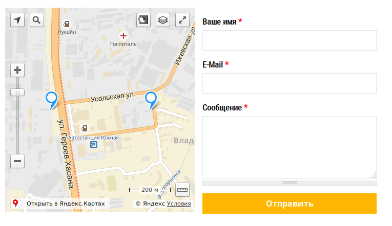
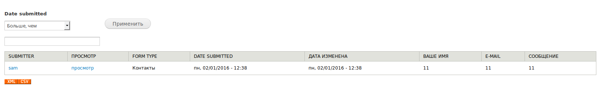

# Форма обратной связи

Форма обратной связи с Яндекс картой.

**Скриншоты в конце описания**

* Динамическая карта
* Несколько пунктов на карте
* На карте: точки, полигоны, линии
* Свободный текст над формой
* Просмотр отправлений
* Оповещение по e-mail
* Выгрузка в XML
* Выгрузка в Excel

Требуемые модули от SL7:
* [sl7_control_panel](https://github.com/SemyonDragunov/sl7_control_panel)

Для Drupal 7. PHP >= 5.4 & 7.

Для продолжения разработки css смотрите bower.json

Автор: Семён Драгунов [sam.dragunov@gmail.com](sam.dragunov@gmail.com)

Apache License 2.0

Если необходима английская версия модуля, пишите **@SemyonDragunov**

***
# Feedback form

The form of feedback from Yandex card.

**Screenshots at the end of the this description**

* Dynamic map
* Multiple items on the map
* On the map: points, polygons, lines
* Free text above the form
* View parcels
* Notification by e-mail
* Unloading into XML
* Unloading in Excel

Required modules from SL7:
* [sl7_control_panel](https://github.com/SemyonDragunov/sl7_control_panel)

For Drupal 7. PHP >= 5.4 & 7.

To continue developing css, see bower.json

Author: Semyon Dragunov [sam.dragunov@gmail.com](sam.dragunov@gmail.com)

Apache License 2.0

If you need an English version of the module, write to user **@SemyonDragunov**

***

